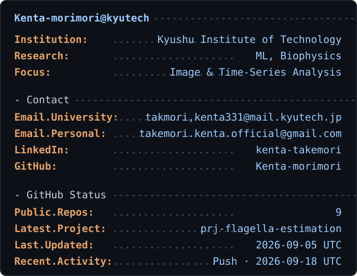

<table>
  <tr>
    <td valign="middle" width="40%" align="center">
      
    </td>
    <td valign="middle" width="60%">
      
    </td>
  </tr>
</table>

---

Last refreshed automatically by GitHub Actions

