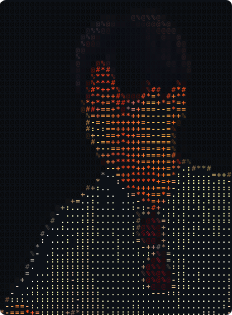

<table>
  <tr>
    <td valign="middle" width="40%" align="center">
      
       
      Color character portrait · rendered from the current GitHub avatar
    </td>
    <td valign="middle" width="60%">
      <h3>Takemori Kenta</h3>
      

        Ph.D. Student · Kyushu Institute of Technology 
        Machine Learning · Biophysics 
        Image Analysis · Time-Series Analysis
      

      <h3>Contact</h3>
      <pre>
Email (University)  <a href="mailto:takmori,kenta331@mail.kyutech.jp">takmori,kenta331@mail.kyutech.jp</a>
Email (Personal)    <a href="mailto:takemori.kenta.official@gmail.com">takemori.kenta.official@gmail.com</a>
LinkedIn            <a href="https://jp.linkedin.com/in/kenta-takemori">kenta-takemori</a>
GitHub              <a href="https://github.com/Kenta-morimori">Kenta-morimori</a>
      </pre>
      <h3>GitHub Status</h3>
      <pre>
public repos      9
latest project    prj-flagella-estimation
last updated      2026-08-30 UTC
recent activity   <em>sample value — generated by GitHub Actions</em>
      </pre>
    </td>
  </tr>
</table>

---

Last refreshed automatically by GitHub Actions

